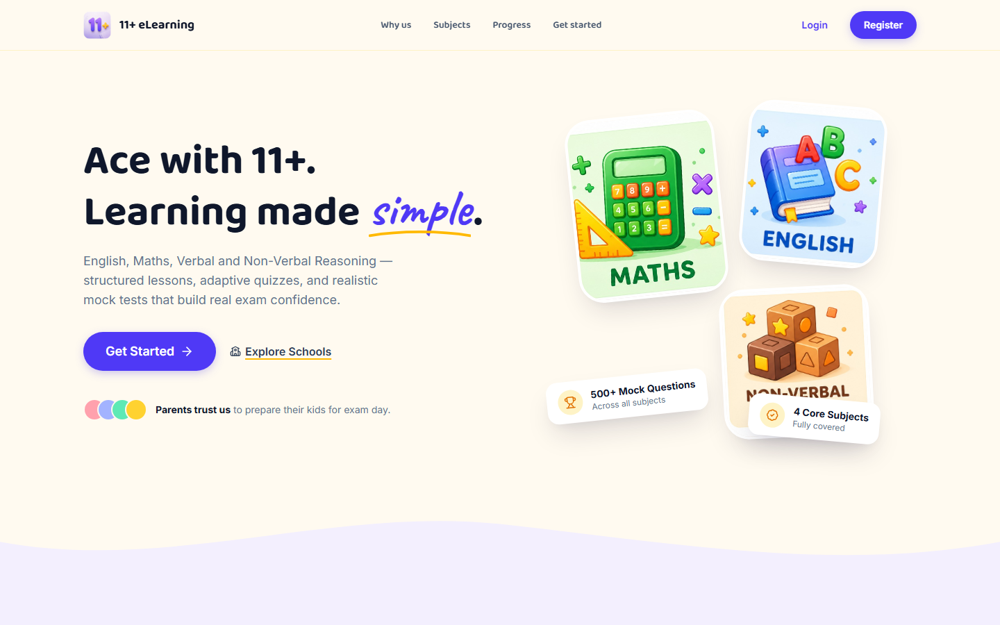
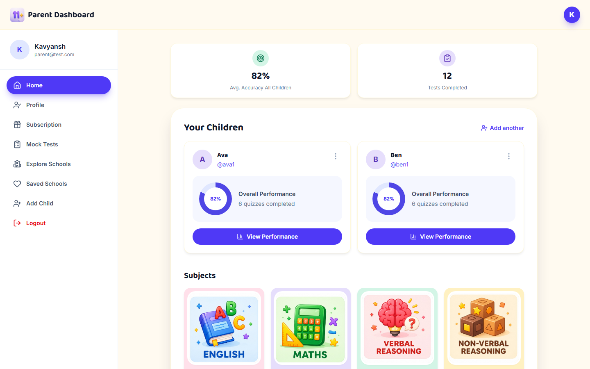
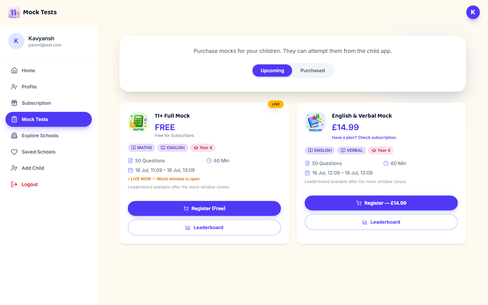

# 11+ eLearning

Exam-prep web app for the UK 11+ — English, Maths, Verbal and Non-Verbal Reasoning. Parents manage children, subscriptions, and mock test registrations; children take timed mock tests and track their progress.



## Features

- **Parent dashboard** — manage multiple children, view accuracy and progress at a glance
- **Subscriptions & mock test purchases** — plan-based access with Stripe checkout
- **Timed mock tests** — exam-style attempts with question palette, review, leaderboards
- **Child portal** — its own login, dashboard, and progress view per child

| Parent Dashboard | Mock Tests |
|---|---|
|  |  |

## Tech stack

React 19 · Vite · Tailwind CSS v4 · React Router · Framer Motion · Stripe

## Getting started

```bash
npm install
cp .env.example .env   # fill in API base URLs, Stripe key, Google Maps key
npm run dev
```

```bash
npm run build   # production build → dist/
npm run lint    # oxlint
```
